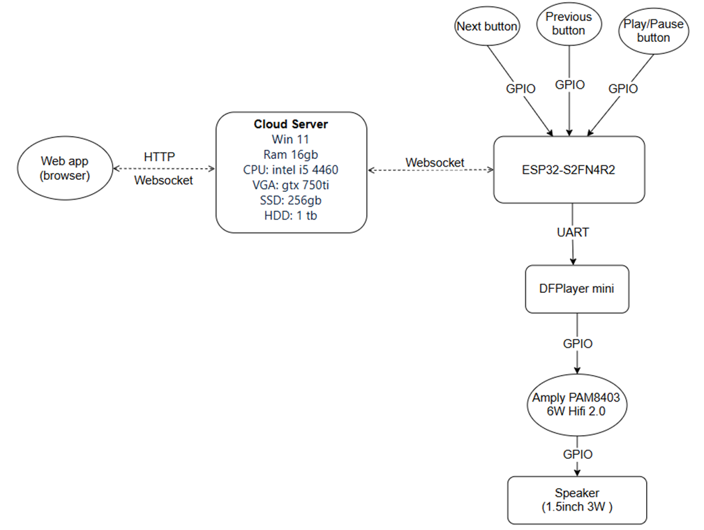
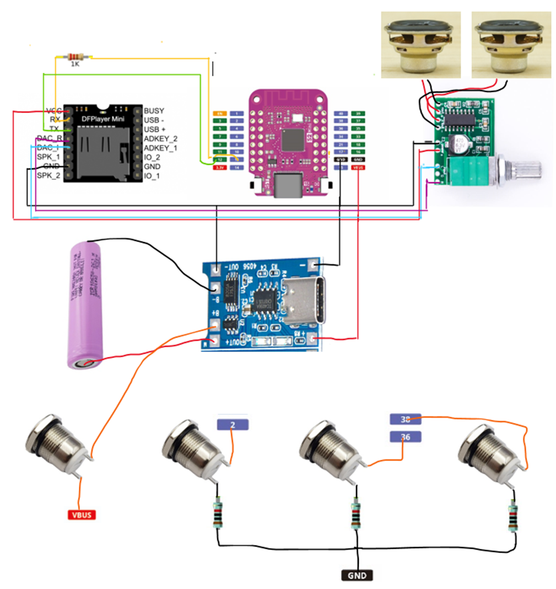

<h1>Hệ thống loa IoT - Speaker IoT </h1>
<h3> Về project </h3>
Speaker IoT là một project giúp bạn có thể điều khiển một chiếc loa trực tiếp bằng nút bấm vật lý trên loa hoặc điều khiển từ xa thông qua một web app. Cung cấp thêm một tùy chọn điều khiển khi bạn không ở gần loa mà vẫn muốn điều khiển nó.

<h3> Chức năng </h3>

- Các nút bấm vật lý trên loa điều khiển bao gồm: Phát bài kế tiếp, phát bài trước đó, Phát/Tạm dừng

- Điều khiển thông qua web app:
    + Phát/Tạm dừng
    + Phát bài kế tiếp
    + Phát bài trước đó
    + Chế độ phát lặp lại, phát ngẫu nhiên
    + Chế độ hẹn giờ tắt nhạc

<h3> Sơ đồ kiến trúc hệ thống </h3>



<h3> Schematic </h3>



<h3> Cài đặt và sử dụng</h3>

<h4> Cài đặt web app </h4>

Làm theo hướng dẫn tại [đây](https://github.com/baovkb/Speaker_server)

<h4> Nạp code cho vi điều khiển </h4>

1. **Clone project**

```git clone https://github.com/baovkb/Speaker```

2. **Cấu hình**

Sử dụng Smart Config để cấu hình ssid, password wifi từ xa. Tải app và hướng dẫn có tại [đây](https://github.com/espressif/esp-idf/tree/v5.3/examples/wifi/smart_config)

Trong [main.c](main/main.c) tìm biến gateway, đây là gateway kết nối websocket của server, chỉnh sửa lại cho đúng server của bạn.
Sau đó nạp code tùy theo từng IDE sử dụng

**Lưu ý**: Các file trong thẻ nhớ không sử dụng tiếng việt và kí tự đặc biệt và không để trong bất kỳ thư mục nào

<h3> Nhóm thực hiện </h3>

| STT | Họ tên           | MSSV       | Github                                     |
|:---:| :--------------: | :--------: | :-----------------------------------------:|
|   1 | Phùng Đức Bảo    | 21521860   | [baovkb](https://github.com/baovkb)       |
|   2 | Trần Triều Trung | 21522727   | [trungt203](https://github.com/trungt203) |
